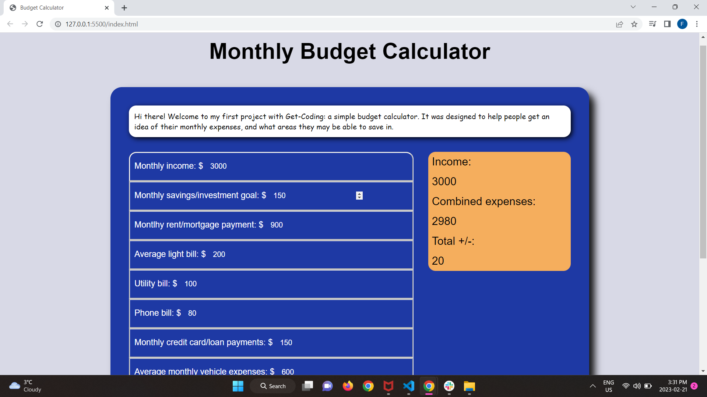

# Budget-calc-project

## A simple monthly budget calculator to help get an idea of your incomes and expenses

This was my first coding project. It is something I thought would be useful to myself, and could be a fun way to start. There is no dynamic option to add your own type of expenses or incomes (maybe I will add this in the future), but hopefully the pre-set options can cover all the bases for you!

* Add your incomes
* Add your expenses
* Calculate them to gauge your incomes vs your expenses

